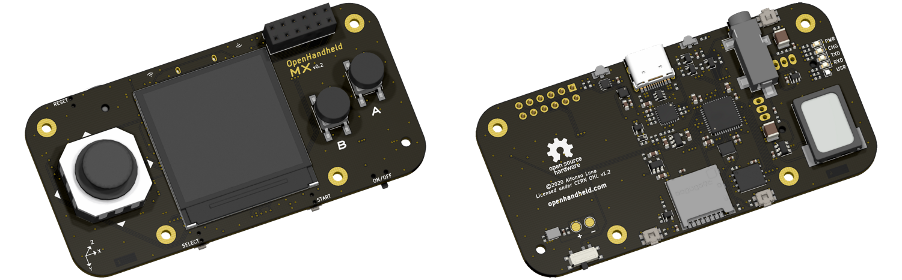

# OpenHandheld MX

This is an early work-in-progress of an open-source development board in the shape of a handheld game console. It isn't yet suited for end-users!

## License

Copyright (c) 2020 AlfonsoJLuna (Alfonso Luna)

* Hardware in this repository is licensed under the CERN OHL v1.2 license. See `Hardware/LICENSE.md` for more information.
* Firmware in this repository is licensed under the MIT license. See `Firmware/LICENSE.md` for more information.

This repository may contain libraries or other files provided by third parties. The above licenses do not apply to these files.
