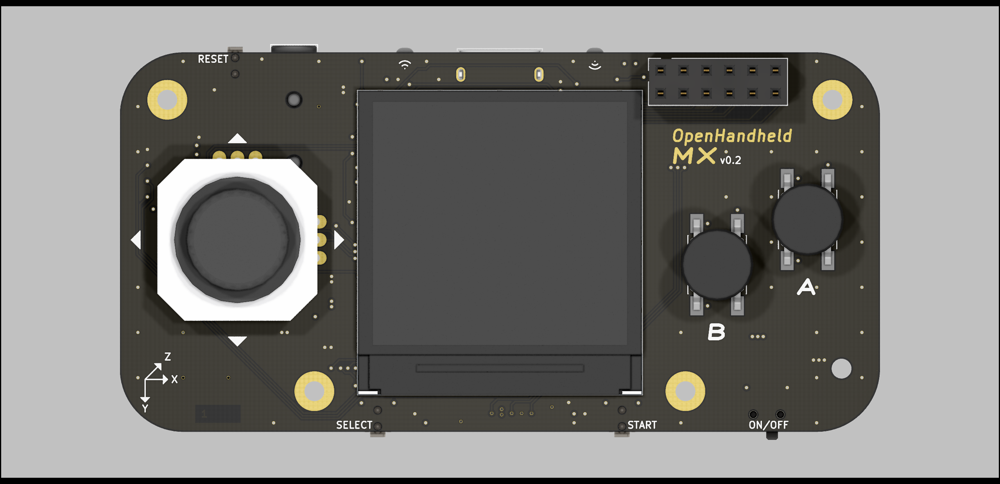
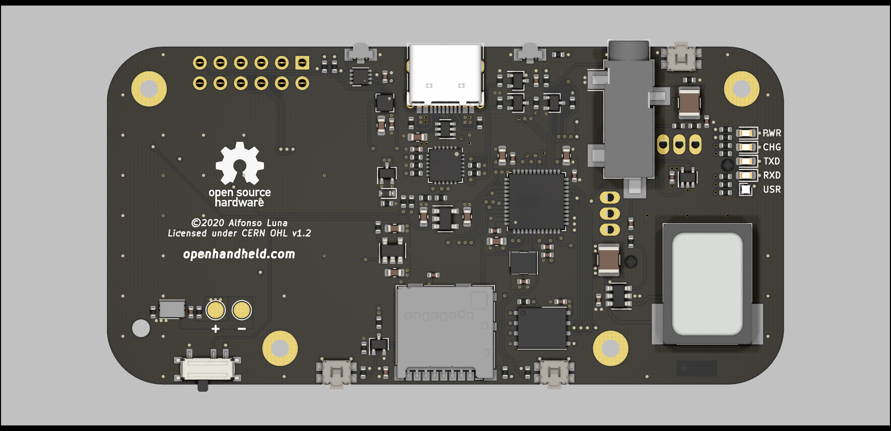

# OpenHandheld MX

Open-source development board in the shape of a handheld game console.

 | 
:---: | :---:
Front | Back

## Related repositories

Example code for this board can be found in [openhandheld-mx-sdk](https://github.com/AlfonsoJLuna/openhandheld-mx-sdk).
